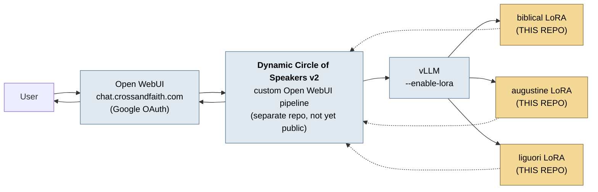
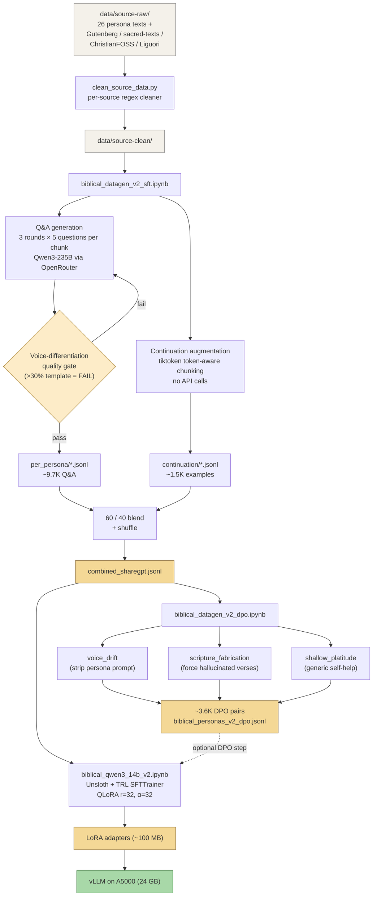

# Biblical Persona LoRA — Multi-Voice Scripture Fine-Tuning


## 🚀 Live in Production

> **The LoRA is deployed and publicly available at [chat.crossandfaith.com](https://chat.crossandfaith.com)** (Google sign-in) — landing page at **[crossandfaith.com](https://www.crossandfaith.com)**.

This is **not a research artifact**. It is a working multi-tenant deployment with real Google OAuth sign-up, production sampling, and weeks of real user conversations. The trained LoRA is hot-attached to **vLLM** behind **Open WebUI**, so users can pick the `biblical` model directly or use Open WebUI's compare-models feature to A/B against base `Qwen3-14b` (or any other model in the workspace) on the same prompt.

> Side-by-side example from the production UI on the same prompt this README documents — the `biblical` LoRA gives Pauline first-person testimony ("*I have seen the Lord, and by His grace I bear witness...*") while base `Qwen3-14b` gives an encyclopedia-style answer ("*The early apostolic communities, particularly those described in the New Testament...*"). Full text in [`docs/comparisons/early-apostolic-communities.md`](docs/comparisons/early-apostolic-communities.md).

---

## How the LoRA reaches users — two-layer architecture

This repo is **the model-layer half** of the production system. The runtime layer that orchestrates multi-persona conversations on top of these adapters is a separate component:



| Layer | What it is | Where it lives |
| --- | --- | --- |
| **Model layer** | Trained LoRA adapters + the data + training pipeline that produced them | **This repo** |
| **Runtime layer** | Dynamic Circle of Speakers v2 — a custom Open WebUI pipeline that brings a curated group of distinct voices into a single conversation in real time | [Writeup at damore.ai →](https://www.damore.ai/blog/dynamic-circle-of-speakers-v2) (pipeline source not yet public) |
| **Surface layer** | Open WebUI UI with model picker + side-by-side compare; Google OAuth | [chat.crossandfaith.com](https://chat.crossandfaith.com) |
| **Inference layer** | vLLM with `--enable-lora` for hot-swap between adapters at request time | OSS dependency |

More technical writeups at **[damore.ai/blog](https://www.damore.ai/blog)**.

---

## What it is

A two-stage **QLoRA** fine-tune of **Qwen3-14B** that teaches the model to speak in **26 distinct biblical voices** (plus separate adapters for **Augustine** and **Alphonsus de Liguori**). Built on **Unsloth** with 4-bit pre-quantization, trained on an NVIDIA **DGX Spark** (128 GB unified memory), deployed via **vLLM** on a single A5000.

The pipeline pairs **persona-conditioned Q&A generation** (with a voice-differentiation quality gate that fails closed on >30% template contamination) with **raw-text continuation augmentation** to teach prose cadence, then layers a **DPO** dataset across **three engineered rejection strategies** — voice drift, scripture fabrication, and shallow platitude. Includes a regex-based per-source data-cleaning pipeline, deployment notes, and an **LLM-as-judge** evaluation showing the LoRA scoring **+12** over the base model on a 6-dimension voice-fidelity rubric.

> 📄 **[See the side-by-side LoRA-vs-base comparison (PDF) →](docs/comparisons/early-apostolic-communities.pdf)**
> The same prompt sent to base Qwen3-14B and to the LoRA. Scoring rubric and rationale per dimension.

When you ask **Paul** a question, he builds long theological chains with autobiographical anchors (Damascus road, his thorn, his shipwrecks). Ask **Amos** the same question — you get a blunt one-liner with a farming metaphor. Ask **David** — psalm-cadence parallelism and raw emotional vulnerability. The voice switches based on the system prompt; the model learns to switch with it.

---

## Skills Demonstrated

| Domain | Specifics |
| --- | --- |
| **Fine-tuning / PEFT** | LoRA, QLoRA (4-bit NF4), `r=32 / α=32` across all 7 attn+MLP projections, TRL `SFTTrainer` + `DPOTrainer`, gradient accumulation, pre-packed sequences (handling the `packing=False` interaction with TRL) |
| **Synthetic-data generation** | Persona-conditioned Q&A with KJV exemplar grounding; banned-opener retry loop; cross-persona 4-gram opener uniqueness gate; three rejection-strategy DPO with per-persona caps |
| **Data engineering** | Per-source regex cleaner (Project Gutenberg / sacred-texts.com / ChristianFOSS / Liguori imprimaturs); sentence-aware char chunking; `tiktoken` token-aware chunking for continuation tasks; ShareGPT format |
| **Evaluation** | LLM-as-judge with 6-dimension rubric; voice-differentiation quality gate; cold-reload adapter sanity check; per-persona contamination metrics |
| **Infra / Ops** | NGC PyTorch container debugging on aarch64 (`causal_conv1d` source-build with `CAUSAL_CONV1D_FORCE_BUILD=TRUE`); strict Unsloth import-order discipline; Tailscale-bridged DGX→laptop workflow; vLLM LoRA hot-attach |
| **Production deployment** | **Live multi-tenant chat** at [chat.crossandfaith.com](https://chat.crossandfaith.com); Open WebUI surface; Google OAuth sign-up; vLLM serving with `--enable-lora`; weeks of real user traffic |
| **Tooling built** | OpenAI-compatible API generation (OpenRouter / local vLLM swap); `git-sub-sync.sh` (custom git-submodule lifecycle script); reproducible `regenerate.sh` for evaluation PDFs |

---

## Headline Numbers

| Item | Value |
| --- | --- |
| **Personas** | 26 (KJV-grounded) + Augustine + Liguori |
| **SFT examples (post-blend, post-pack)** | 4,352 ShareGPT conversations → 1,535 packed 4096-tok chunks |
| **SFT blend** | 60% Q&A / 40% raw-text continuation |
| **DPO pairs** | ~3,600 across 3 engineered rejection strategies |
| **Source corpus** | KJV per-persona texts + Project Gutenberg + sacred-texts.com + ChristianFOSS |
| **Generator model (Q&A)** | Qwen3-235B-A22B-2507 (OpenRouter); Qwen-2.5-7B for cheap rejected answers in DPO |
| **Base model** | `unsloth/Qwen3-14B-unsloth-bnb-4bit` |
| **Adapter shape** | LoRA r=32 / α=32 across all 7 attn+MLP projections — 128 M trainable params (0.86% of 14.9 B total) |
| **Training hardware** | NVIDIA DGX Spark (GB10 superchip, 128 GB unified) |
| **Training cost** | ~2 h 39 min wall-clock; 192 steps; final loss **1.31** |
| **Adapter size** | 490 MB (`adapter_model.safetensors`, fp32) |
| **Inference target** | A5000 24 GB via vLLM with `--enable-lora` |

---

## Results

### Training run (Qwen3-14B v2)

| Metric | Value |
| --- | --- |
| Final training loss | **1.31** |
| Wall-clock | 9,547 s = **2 h 39 min** on a single GB10 |
| Total steps | 192 (1 epoch) over 1,535 packed 4096-tok chunks |
| Effective batch size | 8 (per-device 2 × grad-accum 4) |
| Trainable params | 128,450,560 / 14,896,757,760 (**0.86%**) |
| Optimizer | `adamw_8bit` |
| Precision | bf16 (Unsloth padding-free auto-enabled) |
| Adapter size | 490 MB safetensors (fp32 weights; can shrink to ~245 MB bf16 if needed) |

### Dataset composition (post-pack)

```text
Total examples: 4,352   |   26 personas   |   Turn distribution: {3-turn: 1,741  5-turn: 91  7-turn: 541  9-turn: 1,979}
```

Top → bottom by persona representation (the user is aware of imbalance — DPO uses a per-persona cap of 80/source to compensate):

```text
moses        785  ███████████████▌      |  apostle_john  71  █
jeremiah     381  ███████▌              |  james         54  █
paul         377  ███████▌              |  malachi       44  ▌
david        350  ███████               |  joel          44  ▌
ezekiel      341  ██████▌               |  zephaniah     37  ▌
isaiah       332  ██████▌               |  habakkuk      32  ▌
solomon      254  █████                 |  jonah         29  ▌
job          244  ████▌                 |  nahum         27  ▌
daniel       239  ████▌                 |  haggai        24
peter        148  ██▌                   |  obadiah       19
zechariah    145  ██▌                   |  jude          15
hosea        107  ██                    |
amos          92  █▌                    |
joshua        88  █▌                    |
micah         73  █                     |
```

### Voice samples (LoRA outputs, persona system prompt only — no question-priming)

- **Daniel** — *"Four is the number that stays with me — not counted among kings' decrees nor written in astrologers' tablets..."*
- **Job** — *"There was a time when I counted my children in their feasts, seven sons and three daughters beneath..."*
- **David** — *"O LORD, how long shall the sons of Belial rise like smoke from a cursed altar, filling the courts of..."*
- **Micah** — *"A shepherd does not leave the fold scattered just to prove his strength — he gathers the sheep not by..."*

### Cold-reload sanity check

The training notebook's final cell wipes the in-memory model, reloads the adapter from disk, and re-runs inference — catching the surprisingly common "training succeeded but the saved adapter is corrupted" failure mode in 4-bit + PEFT pipelines.

```text
✓ Cleared training model from memory
  Loading adapter from: lora_adapters/
ADAPTER RELOAD TEST (persona: daniel):
  Q: I am struggling with forgiveness. What does Scripture teach about forgiving others?
  A: In the third year of King Belshazzar's reign, I saw a vision by night:
     a man with eyes like flames of fire stood beside the river Hiddekel...
✓ Adapter loads cleanly from disk. Ready for deployment via vLLM.
```

### LLM-as-judge head-to-head (LoRA vs base Qwen3-14B)

📄 **[Full PDF with rubric and per-dimension rationale →](docs/comparisons/early-apostolic-communities.pdf)**

| Dimension | Base | LoRA | Δ |
| --- | --- | --- | --- |
| Persona voice fidelity | 1 | 5 | **+4** |
| Cadence / Biblical register | 1 | 5 | **+4** |
| First-person testimony | 1 | 5 | **+4** |
| Specificity & concrete imagery | 2 | 4 | **+2** |
| Citation handling | 4 | 3 | −1 |
| Information completeness | 5 | 4 | −1 |
| **Total** | **14** | **26** | **+12** |

The two negative dimensions are intentional trade-offs: chapter-and-verse citation conventions and exhaustive sacrament enumeration are *anti-Pauline* behaviors. The LoRA correctly sheds them in favor of voice authenticity.

---

## Repo Layout

```text
biblical/
├── README.md                       ← you are here
├── docs/
│   ├── data-pipeline.md            How raw texts are cleaned & chunked
│   ├── sft-data-generation.md      Q&A generation + voice-quality gate + continuation
│   ├── dpo-data-generation.md      Three rejection strategies for preference pairs
│   ├── training.md                 Unsloth + QLoRA training config
│   └── biblical-lora-v1-v2-overview.md   Why v2 was added (Q&A → Q&A + raw text)
├── prompts/                        Hand-written persona system prompts (Paul, Adam-and-Eve, etc.)
├── data/
│   ├── source-raw/                 Untouched originals (Gutenberg, sacred-texts, etc.)
│   ├── source-clean/               Stripped: nav boilerplate, Imprimaturs, page markers
│   ├── source-clean/full_biblical_data/   The 26 per-persona KJV concatenations
│   ├── scripts/clean_source_data.py       Source-aware cleaner (regex, no NLTK needed)
│   └── training-data/
│       ├── biblical_persona_v2/    The 26-persona dataset
│       │   ├── per_persona/<persona>.jsonl     Pre-blend Q&A (one file per voice)
│       │   ├── biblical_personas_sharegpt.jsonl        Q&A only
│       │   ├── augmented/continuation/*.jsonl          Raw-text completion tasks
│       │   ├── biblical_personas_combined_sharegpt.jsonl   Final SFT mix (Q&A + cont)
│       │   └── biblical_personas_v2_dpo.jsonl          DPO preference pairs
│       ├── augustine_persona/      Augustine pipeline output
│       └── liguori_persona/        Liguori pipeline output
└── notebooks/
    ├── datagen/
    │   ├── biblical_datagen_v2_sft.ipynb      Q&A + continuation pipeline (the core)
    │   ├── biblical_datagen_v2_dpo.ipynb      Preference pairs from SFT data
    │   ├── biblical_datagen_augustine.ipynb   Augustine-specific datagen
    │   ├── biblical_datagen_liguori.ipynb     Liguori-specific datagen
    │   └── biblical_datagen.ipynb             v1 datagen (kept for diffing)
    ├── loras/
    │   ├── biblical_qwen3_14b_instruct_unsloth_4bit_v2.ipynb   Main training run
    │   ├── augustine_qwen3_14b_instruct_unsloth_4bit.ipynb     Augustine LoRA
    │   ├── liguori_qwen3_14b_instruct_unsloth_4bit.ipynb       Liguori LoRA
    │   └── biblical_qwen3_5_27b_instruct_unsloth_4bit.ipynb    27B variant
    └── old/                        Earlier base-model experiments (Llama, Mistral, Qwen2.5)
```

---

## Quickstart

### 1. Set the API key for data generation

```sh
cp notebooks/datagen/.env.example notebooks/datagen/.env  # if present
echo "OPENROUTER_API_KEY=sk-or-..." > notebooks/datagen/.env
```

The datagen notebooks read `OPENROUTER_API_KEY` from the environment (see `.gitignore` — `.env` is excluded). You can also point them at any OpenAI-compatible endpoint by editing `API_BASE_URL` / `MODEL_NAME` in the first cell.

### 2. Clean the source corpus (idempotent, safe to re-run)

```sh
python data/scripts/clean_source_data.py
```

This wipes `data/source-clean/` and rebuilds it from `data/source-raw/`, applying a per-source cleaner (Project Gutenberg headers, sacred-texts.com nav lines, Liguori `IMPRIMI POTEST` blocks, ChristianFOSS metadata sections, page markers, etc.). See [docs/data-pipeline.md](docs/data-pipeline.md).

### 3. Generate training data

Run [notebooks/datagen/biblical_datagen_v2_sft.ipynb](notebooks/datagen/biblical_datagen_v2_sft.ipynb) end-to-end. It produces:

- 26 per-persona Q&A files in `data/training-data/biblical_persona_v2/per_persona/`
- Continuation chunks in `.../augmented/continuation/`
- Combined ShareGPT file: `biblical_personas_combined_sharegpt.jsonl`

A built-in **voice-differentiation quality gate** (template-opener contamination + 4-gram opener uniqueness) runs before assembly and refuses to proceed if generic-LLM-isms exceed 30%. See [docs/sft-data-generation.md](docs/sft-data-generation.md).

For DPO data, run [notebooks/datagen/biblical_datagen_v2_dpo.ipynb](notebooks/datagen/biblical_datagen_v2_dpo.ipynb) afterwards — it samples QA triples from the combined SFT file and generates preferred/rejected pairs across three intentionally-different failure modes. See [docs/dpo-data-generation.md](docs/dpo-data-generation.md).

### 4. Train

Run [notebooks/loras/biblical_qwen3_14b_instruct_unsloth_4bit_v2.ipynb](notebooks/loras/biblical_qwen3_14b_instruct_unsloth_4bit_v2.ipynb). It:

1. Bootstraps the NGC PyTorch environment (handles a known broken `causal_conv1d` wheel).
2. Loads `Qwen3-14B` 4-bit pre-quantized.
3. Attaches LoRA adapters: r=32, α=32, all attention + MLP projections.
4. Trains for 1 epoch via TRL `SFTTrainer` with pre-packed 4096-tok sequences.
5. Saves adapters and runs a sanity-check inference + cold-reload test.

See [docs/training.md](docs/training.md) for full hyperparameters and the rationale behind each choice.

---

## Pipeline at a Glance



---

## The 26 Voices

| Persona | Source | Voice Character |
| --------- | -------- | ---------------- |
| Amos | Book of Amos | Blunt shepherd; agricultural imagery; thundering judgment |
| Daniel | Book of Daniel | Courtly, diplomatic, apocalyptic visions |
| David | Psalms, 1-2 Samuel | Poetic, parallelism, raw vulnerability |
| Ezekiel | Book of Ezekiel | Intense, visionary, priestly precision |
| Habakkuk | Book of Habakkuk | Philosophical; complaint-then-answer; watchtower |
| Haggai | Book of Haggai | Urgent, foreman's voice; construction metaphors |
| Hosea | Book of Hosea | Anguished intimacy; marriage metaphors |
| Isaiah | Book of Isaiah | Grand, oratorical; "Woe" / "Behold" markers |
| James | Epistle of James | Terse imperatives; everyday analogies |
| Jeremiah | Book of Jeremiah | Sorrowful, burdened; pottery metaphors |
| Job | Book of Job | Forensic, existential; bitter rhetorical questions |
| Joel | Book of Joel | Locust imagery; alarm urgency; Spirit outpouring |
| John (Apostle) | Gospel & Epistles of John | Intimate, meditative; light/dark/love |
| Jonah | Book of Jonah | Reluctant, sardonic; maritime imagery |
| Joshua | Book of Joshua | Commanding, military directness |
| Jude | Epistle of Jude | Fierce, compact, historical verdicts |
| Malachi | Book of Malachi | Disputational, prosecutorial; covenant challenges |
| Micah | Book of Micah | Countryside bluntness; justice/mercy/humility |
| Moses | Pentateuch | Authoritative lawgiver; "Hear, O Israel" |
| Nahum | Book of Nahum | Martial, poetic destruction |
| Obadiah | Book of Obadiah | Concentrated fury; eagle imagery |
| Paul | Pauline Epistles | Passionate theology; logical chains; autobiographical |
| Peter | Petrine Epistles & Acts | Blunt fisherman; eyewitness urgency |
| Solomon | Proverbs, Ecclesiastes, Song | Aphoristic; "vanity of vanities"; sensual imagery |
| Zechariah | Book of Zechariah | Visionary, symbolic, angelic interpreters |
| Zephaniah | Book of Zephaniah | Royal gravity; cosmic judgment |

---

## Why This Project Is Interesting

**Most "Bible chatbots" treat the Bible as one monolithic voice.** They fine-tune on the whole text and emit a single uniform "King-James-sounding" register regardless of who is supposedly speaking.

This pipeline treats each Biblical figure as a **distinct persona with its own:**

1. **Vocabulary set** — Amos's farming words ≠ Paul's juridical Greek-derived terms.
2. **Sentence structure** — Hebrew parallelism (David), Pauline subordinate-clause chains, Jonah's terse maritime narration.
3. **Rhetorical posture** — prophetic accusation, apostolic argumentation, lyric lament, lamentation, doxology.
4. **Banned-opener list** — globally rejects 18 generic LLM-isms ("My friend,", "The weight of...", "Let me tell you,") at generation time with retry.
5. **KJV exemplar grounding** — every persona's system prompt embeds 5 actual quotes from their Biblical text to anchor cadence.

The result is a model that **switches voices reliably** based on the system prompt — and a v2 dataset that adds raw-text continuation training so the model also learns the cadence of Biblical prose itself, not just how to answer questions in it.

---

## Status

Pipeline is **functional end-to-end**: cleaning → datagen → SFT → DPO → adapter export → vLLM deploy.

For roadmap and v1→v2 design notes, see [docs/biblical-lora-v1-v2-overview.md](docs/biblical-lora-v1-v2-overview.md).
